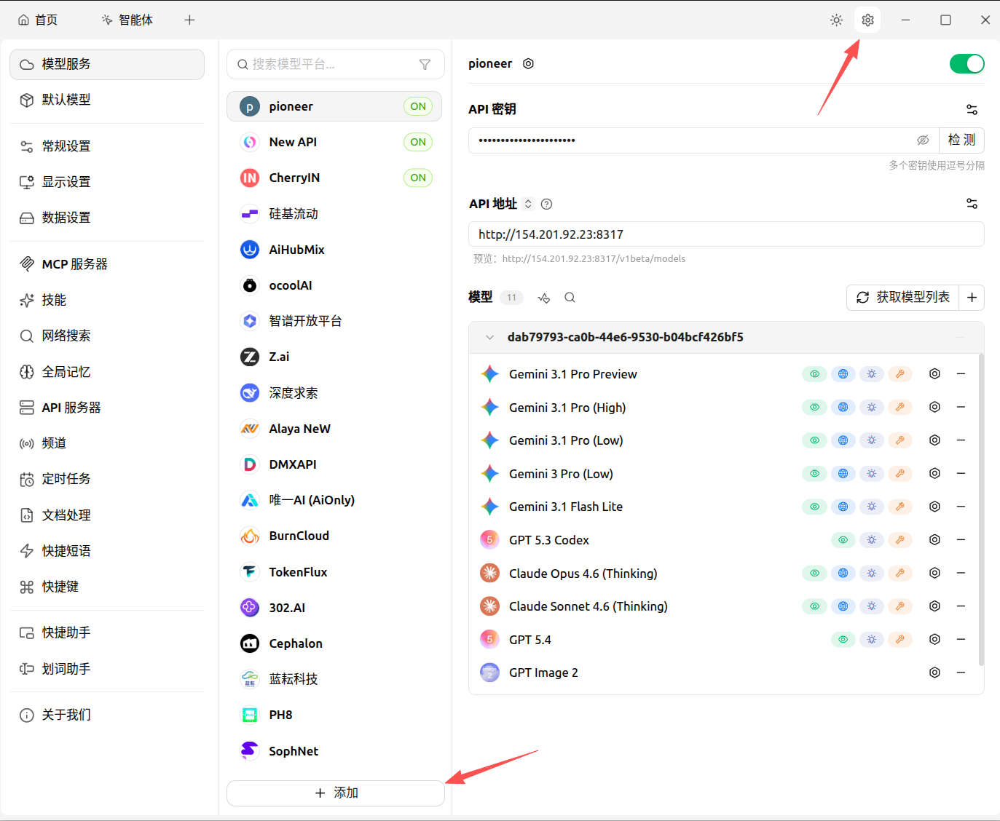
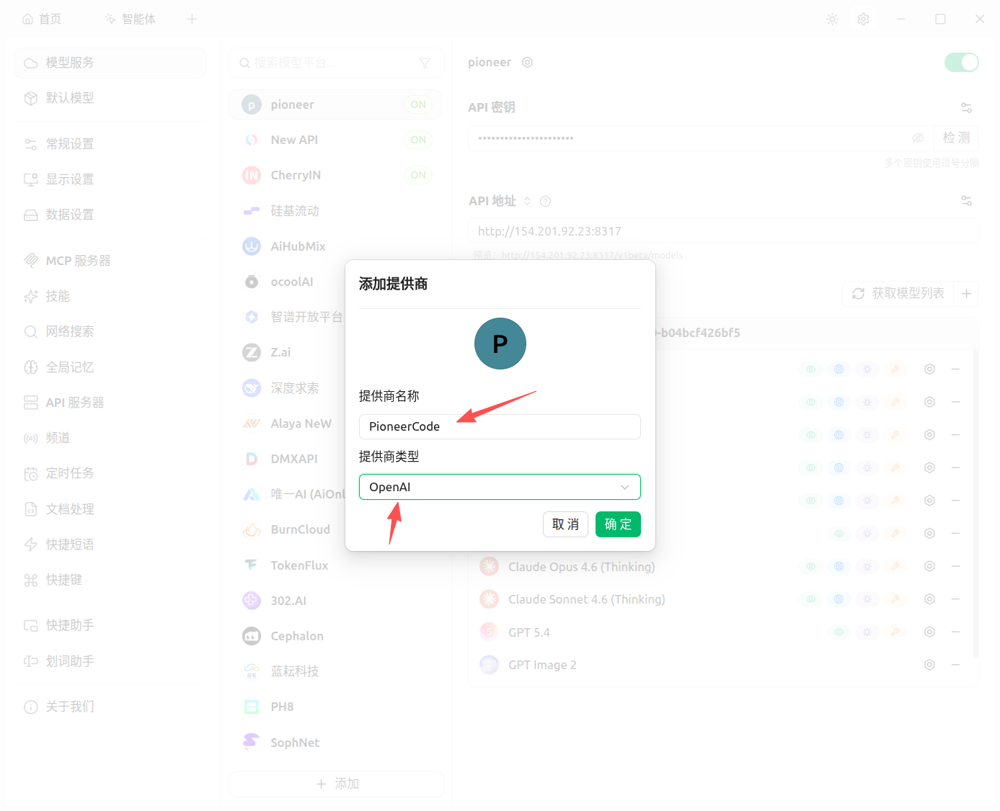
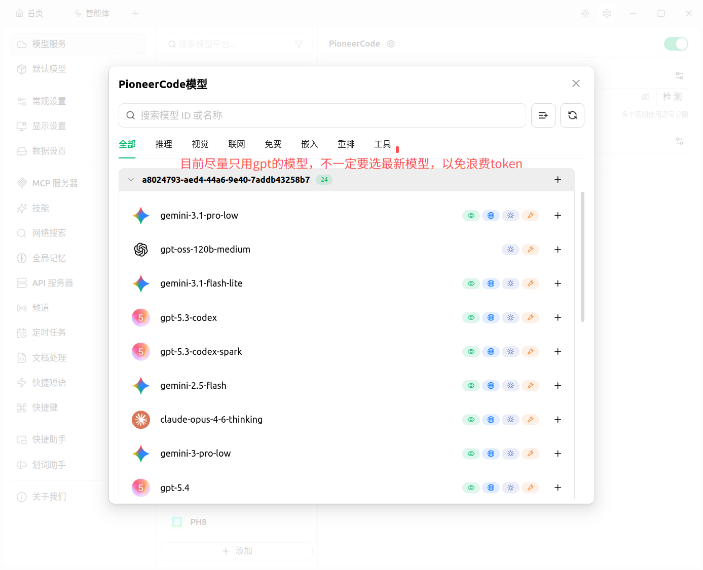
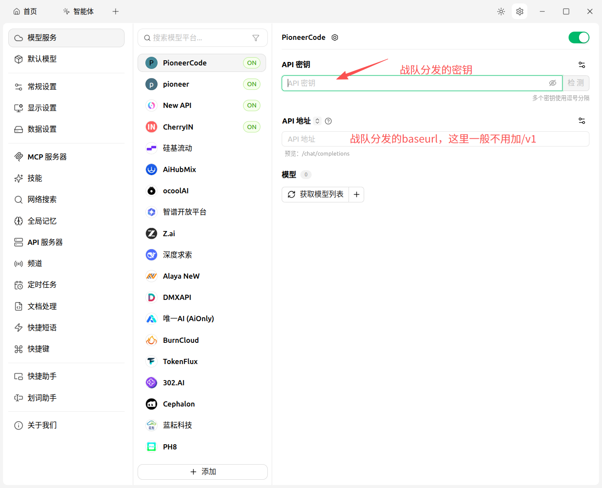
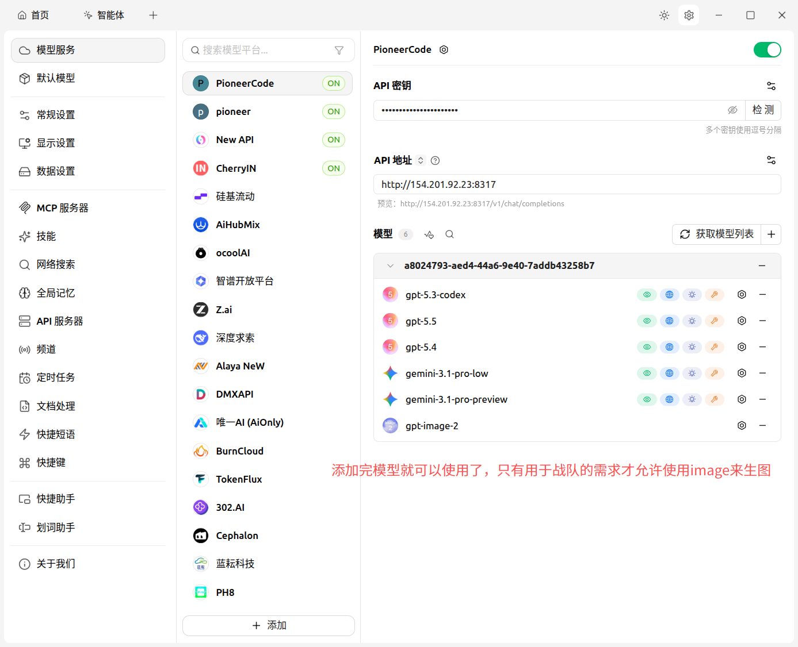

# Cherry Studio 使用教程

## 1. 准备信息

使用前请先准备两项信息：

- API 地址：`http://154.201.92.23:8317`
- API 密钥：战队分发给你的个人密钥，通常以 `sk-` 开头

> 注意：API 地址一般不要手动追加 `/v1`，Cherry Studio 会根据 OpenAI 类型自动拼接接口路径。

## 2. 添加模型服务提供商

1. 打开 Cherry Studio。
2. 点击右上角齿轮图标，进入设置。
3. 在左侧菜单选择“模型服务”或“API 服务”。
4. 点击左下角“添加”。

5. 在弹窗中填写：
   - 提供商名称：`PioneerCode`
   - 提供商类型：`OpenAI`
6. 点击“确定”。

## 3. 填写 API 密钥和 API 地址

进入刚创建的 `PioneerCode` 提供商后，填写以下内容：

- API 密钥：粘贴战队分发给你的个人密钥
- API 地址：`http://154.201.92.23:8317`

填写完成后，可以点击“检测”或“获取模型列表”。

## 4. 添加可用模型

获取模型列表后，按需添加模型即可。

推荐优先添加以下 GPT 模型：

- `gpt-5.5`
- `gpt-5.4`
- `gpt-5.3-codex`
- `gpt-5.3-codex-spark`

也可以按需添加 Gemini、Claude 等模型，但日常代码与问答建议优先使用 GPT 系列，避免不必要的 Token 浪费。

> `gpt-image-2` 属于生图模型，仅在战队确有图片生成需求时使用。

添加完成后，模型列表中会显示已添加的模型。

## 5. 设置默认模型

1. 回到 Cherry Studio 左侧菜单。
2. 进入“默认模型”。
3. 将日常聊天、代码、翻译等默认模型设置为已添加的 GPT 模型，例如 `gpt-5.5`。
4. 保存设置。

## 6. 开始使用

配置完成后，回到首页新建对话，即可选择 `PioneerCode` 下的模型进行使用。

建议用法：

- 普通问答：选择 `gpt-5.5` 或 `gpt-5.4`
- 代码生成与代码分析：选择 `gpt-5.3-codex` 或 `gpt-5.5`
- 长文本总结：选择稳定的 GPT 模型
- 图片生成：仅在必要时选择 `gpt-image-2`

## 7. 常见问题

### 7.1 获取模型列表失败

请检查：

- API 地址是否填写为 `http://154.201.92.23:8317`
- API 密钥是否完整复制
- 网络是否正常
- 提供商类型是否选择为 `OpenAI`

### 7.2 提示无权限或认证失败

通常是 API 密钥填写错误、密钥被多复制了空格，或密钥尚未启用。请重新复制个人密钥再测试。

### 7.3 模型能看到但调用失败

可能是模型暂时不可用、上游额度不足或网络波动。可以换一个 GPT 模型重试。

### 7.4 为什么 API 地址预览里会出现 `/v1/chat/completions`

这是正常现象。你只需要填写基础地址 `http://154.201.92.23:8317`，Cherry Studio 会自动拼接 OpenAI 兼容接口路径。

## 8. 使用规范

- API 密钥仅限本人使用，不要转发给他人。
- 不要把密钥截图发到群里或公开平台。
- 不要在无关需求下使用生图模型，避免浪费额度。
- 优先选择 GPT 系列模型完成日常学习、代码、问答任务。
- 如果发现异常消耗或无法调用，请联系管理员处理。
